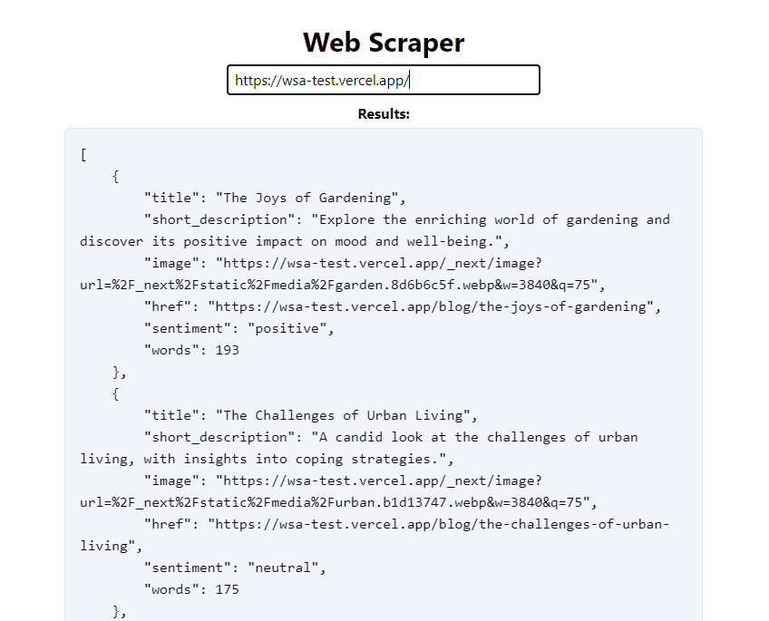

# Web Scraping Analyzer API + Web

### Showcase

This is the web interface of the application:


### Usage

#### Starting the project

After cloning the repository, install all the required moduels using `npm install`.

To run the application in dev mode: `npm run dev`. The server will start by default on port 8000. Modify the property PORT inside `.env` file to run on a different port.

To create a build of the application: 
1. `npm run build`
2. Copy the `/public` folder inside the build folder
3. `npm run start`

#### Using the API

To use the API make a GET request to the following endpoint, proving the URL to be analyzed.

```http://localhost:8000/api/analyze?url=INSERT_YOUR_URL```

#### Using the web interface

The web interface is available on the same port, on the homepage (the only page):

```http://localhost:8000```

You can expect a JSON response such as the following, where the title, a short description, an image associated with the article, its link, a sentiment, and a word count is provided.

```
[
    {
        "title": "The Joys of Gardening",
        "short_description": "Explore the enriching world of gardening and discover its positive impact on mood and well-being.",
        "image": "https://wsa-test.vercel.app/_next/image?url=%2F_next%2Fstatic%2Fmedia%2Fgarden.8d6b6c5f.webp&w=3840&q=75",
        "href": "https://wsa-test.vercel.app/blog/the-joys-of-gardening",
        "sentiment": "positive",
        "words": 193
    },
    {
        "title": "The Challenges of Urban Living",
        "short_description": "A candid look at the challenges of urban living, with insights into coping strategies.",
        "image": "https://wsa-test.vercel.app/_next/image?url=%2F_next%2Fstatic%2Fmedia%2Furban.b1d13747.webp&w=3840&q=75",
        "href": "https://wsa-test.vercel.app/blog/the-challenges-of-urban-living",
        "sentiment": "neutral",
        "words": 175
    },
    ...
]
```

### Explanation

#### Choices

Seeing that some websites load content dinamically and that the articles are not available by simpling inspecting the HTML file, I used Selenium WebDriver to create browser sessions and inspect what is loaded. This ensures that we scrape the same thing that the users sees.

I decided to use the links found in the page as a starting point the search for articles. In order for a link to qualify as an article it needs to:
1. have a title, to avoid elements such as icons
2. have a short description, to avoid links pointing to things an About, Contact or Terms of use page.

In order to find information, the algorithm is inspecting the DOM hierarchy for neighbours without going high enough to find links to other potential articles.

For the word count, I'm using the title of the article as a starting point, and similarly as in 2., looking for a large body of text that sits closely in the DOM.

For sentiment analysis, a small dictionary with words either positive or negative was used. Similar to counting in Blackjack, we start with a value of 0 to which we add +1 for positive word matches and -1 for negative word matches. At the end, the value is weighed down by the number of words of the article. This will allow us to find a neutral sentiment for the article if the value is close to 0, positive if the value is positive, or negative if the value is negative.

#### Proposals

1. Database where we could store the information we scraped and maybe the image we pulled. The tool is only usable in real-time, the links to the article or the image could become obsolete. This depends on the scope of the scraper and whether it wants to have a historical feature or not.
2. Option in the API to also provide the body of the article. It shouldn't make the payload too large since it is just text.
3. The web interface could showcase the data using HTML. We could display the image found or have a table with filters and sorts.

#### New technologies used

Selenium WebDriver: Occasionally somewhat difficult to use, but surprisingly fast considering what it does.

Tailwind: I think it is a useful tool to quickly add built-in styles, but I think it requires a larger application in order to justify creating themes and overriding styles.


